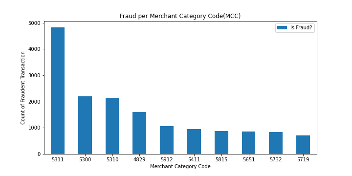
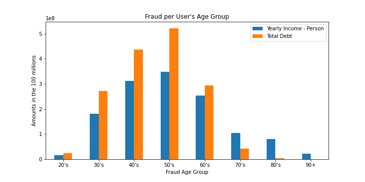
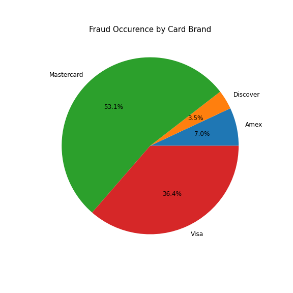

# Predicting Credit Card Transaction Fraud 
## Group members: Aaron DeVore, Ariana Garcia, Waynette Burke, Jessica Ermovick 
## Project Description 
In this project, the Team is attempting to analyze credit card transactions to 
determine predictability of catching fraudulent transactions with greater expediency
than current methods. We will visualize the data to see interesting trends in various 
features of the data and how it relates to the fraudulent transactions as well as attempt to create a predictive model that sufficiently predicts a fraudulent transaction.  

## Data Sources
The following data sources were used in preparing visualizations and models for this project:
[Here!](https://www.kaggle.com/datasets/ealtman2019/credit-card-transactions)

## Table of Contents
- [Rationale](#rationale)
- [Extract](#extract)
- [Transform](#transform)
- [Load](#load)
- [Visualizations](#visualizations)
- [Models](#models)
- [Metadata](#metadata)
- [Results](#results)
- [Credits](#credits)
 

## Rationale
Credit and Debit card frauds are a growing problem worldwide. As we reach the holiday season, billions of dollars will be fraudulently spent using Credit and Debit cards. In this project, we will attempt to find an efficient model to predict fraud in card transactions. We will also quantify the fraud crisis in an attempt to raise awareness of the trends occurring within this crisis. Target Audience: Banking industry.   
## Extract
Extraction is being done via an existing historical dataset found [Here](https://www.kaggle.com/datasets/ealtman2019/credit-card-transactions).
Should a banking industry decide to utilize the model, connecting to the banking data via odbc, jdbc, flat files, or even AWS RDS could easily be implemented. At the time of this project, direct access to bank records was not available. The act of accessing credit card information to predict credit card information is the equivalent of stealing the credit card information. To prevent legal issues, the transactions used are generated from a multi-agent virtual world simulation performed by IBM to simulate real-world data.  
The data is a set of three comma-separated value files (*.csv files) containing simulated user, card, and transaction data, see Metadata section for details on data.  

## Transform
Transformations needed for this data ranged depending on the processes being performed.
### Visualization Transformations
For tableau visualizations, data was cleaned and filtered to return only the locations as well as focus on only fraudulent transactions to present a heat map of fraud locations. The intent is to investigate the locations of fraudulent transactions to find possible trends in the data.

For the exploration of data in general- the focus remained on fraudulent transactions only. The dataset was over 24 million rows, a filter for the data in a way to provide data visualizations on the most impactful sections of data was needed. For that, the data was set to investigate only the fraudulent transactions.

The Card types, Transaction types, locations, merchant codes, as well as card holder age-groups were leveraged to provide data visualizations. 

### Models
The data for creation of models needed several columns cleaned, grouped, and transformed. The `Year`,`Month`,`Day`,`Time` columns needed merged and transformed into UTC format for use in Tensorflow. The `Amount` column was grouped into semi-equal occurrences of amount ranges. For example, if $200-$300 is seen 2 million times, where 300-600 through 9,000-12,000 amounts combined were seen 2 million times, groups would be $200-300,and $301-12,000, etc. Some columns were deemed unnecessary for predictive modeling. The columns `Merchant Name`,`Merchant City`,`Merchant State`,`Zip` would have added too much noise to the model- having 24 million rows of data across a multitude of merchants, and locations. The column `Card Number` was also not necessary, there were millions of individual card numbers that would have added noise to the model. These numbers are only simulated data, meaning any correlation found would have convoluted results instead of clarifying.  

## Load
Data was pulled from [This Site!](https://www.kaggle.com/datasets/ealtman2019/credit-card-transactions). It was loaded directly into google colaboratory and jupyter notebooks. No intermediary database was needed. 
### Tableau Load
Data was filtered in tableau to produce only fraudulent transactions, saved to a file, and uploaded into tableau public. Heat maps were created from the filtered data to display areas sufferring from the higher levels of fraudulent activities.
### Jupyter Notebook and Google Colaboratory Load
Jupyter Notebooks and Google Colaboratory were used to do all data transformations and loads. The data exploration code can be found [Here](https://github.com/OP78142/UTSA-Bootcamp-Final/blob/main/Credit%20Card%20Data%20Analysis.ipynb)
### Model Load details and process
Placeholder for type of model being run, layers, and percentages here  

## Visualizations
Visualizations were created using Python and Tableau Public. 
### Tableau
Tableau was leveraged to create an interactive dashboard to determine where the higher levels of fraud were occurring. They can be found at the following locations [1990-2000](https://public.tableau.com/views/CreditCardFraudMap1990-2000/CreditCardFraudMap1990-2000?:language=en-US&:display_count=n&:origin=viz_share_link), [2001-2010](https://public.tableau.com/views/CreditCardFraudMap2001-2010/CreditCardFraudMap2001-2010?:language=en-US&:display_count=n&:origin=viz_share_link), and [2011-2020](https://public.tableau.com/views/CreditCardFraudMap2011-2020/CreditCardFraudMap2011-2020?:language=en-US&publish=yes&:display_count=n&:origin=viz_share_link). 

 

[Ages](https://op78142.github.io/UTSA-Bootcamp-Final/templates/Fraud-by-Age.html) displays age groups for cardholders, as well as the count of fraudulent transactions and debt levels for these cardholders. 
 

[Cards](https://op78142.github.io/UTSA-Bootcamp-Final/templates/Fraud-about-Card.html) displays data about the cards. How many fraudulent transactions were debit or credit, as well as which card provider was most vulnerable to fraudulent transactions- Visa, Mastercard, etc. 
 
## Predictive Model Process
placeholder for steps taken for predictive model process here!

## Metadata
### Table Name: sd254_cards.csv 
|Column Name                              |Description                              |Data Type          |
|:----------------------------------------|:----------------------------------------|:------------------|
|User                                     |ID field to distinguish card user        |Binary [1|0]       |
|CARD INDEX                               |ID field for each card a User ID owns    |Integer            | 
|Card Type                                |Type of card: Visa, Mastercard, etc      |String             |     
|Card Number                              |Unique card number                       |Big Int            | 
|Expires                                  |Expiration date of card                  |Date MM/YYYY       |  
|CVV                                      |Card Verification Value (3 digit code)   |Integer            |      
|Has Chip                                 |Indicator of presense of chip Y/N- 1/0   |Binary [1|0]       |   
|Cards Issued                             |Number of cards issued for a card number |Integer            | 
|Credit Limit                             |Limit of user- not always equal to card  |Currency USD       | 
|Acct Open Date                           |Date account opened MM/YYYY format       |Date MM/YYYY       | 
|Year PIN last Changed                    |4 digit year of last time PIN was changed|Integer 4 digit Yr | 
|Card on Dark Web                         |Was card number found on dark web Yes/No |Yes/No             | 

### Table Name: sd254_users.csv 

|Column Name                              |Description                              |Data Type          |
|:----------------------------------------|:----------------------------------------|:------------------|
|Person                                   |Name of Cardholder  -First Last          |String             |
|Current Age                              |Current Age of Cardholder                |Integer            |  
|Retirement Age                           |Age at Retirement-estimated              |Integer            |    
|Birth Year                               |Year of Cardholder Birth                 |Integer 4 digit Yr |  
|Birth Month                              |Month of Cardholder Birth                |Integer 2 digit Mo |  
|Gender                                   |Gender of Cardholder -Female/Male        |String             |  
|Address                                  |Address of Cardholder                    |String             |  
|Apartment                                |Apt # of Cardholder                      |Number             |  
|City                                     |City of Cardholder                       |String             |  
|State                                    |State of Cardholder                      |String             |
|Zipcode                                  |Zipcode of Cardholder                    |Number             |
|Latitude                                 |Latitude of City                         |Decimal            | 
|Longitude                                |Longitude of City                        |Decimal            |
|Per Capita Income - Zipcode              |Per Capita Income of Zipcode             |Currency USD       |
|Yearly Income - Person                   |Yearly Income of Cardholder              |Currency USD       |
|Total Debt                               |Total Debt of Cardholder                 |Currency USD       |
|FICO Score                               |Credit score of Cardholder               |Integer            |
|Num Credit Cards                         |Number of Credit cards issued to person  |Integer            | 

### Table Name: credit_card_transactions-ibm_v2.csv 
|Column Name              |Description                              |Data Type          |
|:----------------------- |:----------------------------------------|:------------------|
|User                     |ID to describe user                      |Integer            |
|Card                     |ID to describe each card a user owns     |Integer            |
|Year                     |Year of Transaction- 4 digit Yr          |Integer            |
|Month                    |Month of Transaction- 1 or 2 Digits      |Integer            |
|Day                      |Day of Transaction- 1 or 2 Digits        |Integer            |
|Time                     |Time of Transaction- 00:00 format        |Time 00:00         |
|Amount                   |Amount Transaction- US Dollars           |Currency USD       |
|Use Chip                 |Type of transaction (Swipe/Online/Chip)  |String             |
|Merchange Name           |ID describing Merchant/Business          |Big Integer        |
|Merchant City            |City Merchant Business Resides           |String             |
|Merchant State           |State Merchant Business Resides          |String             |
|Zip                      |Zipcode of Merchange                     |Integer            |
|MCC                      |Merchant Category Codes-merchant type    |Integer            |
|Errors?                  |Type of transaction error occurred/null  |String             |
|Is Fraud?                |Is the transaction fraudulent? Yes/No    |String Y/N         | 

## Results
Placeholder for results here!  

## Credits
The collaborators on this project are: 
Aaron Devore https://github.com/OP78142,
Waynette Burke https://github.com/WayBurke,
Ariana Garcia https://github.com/arianajoslyn, and
Jessica Ermovick https://github.com/Jermov  

 
